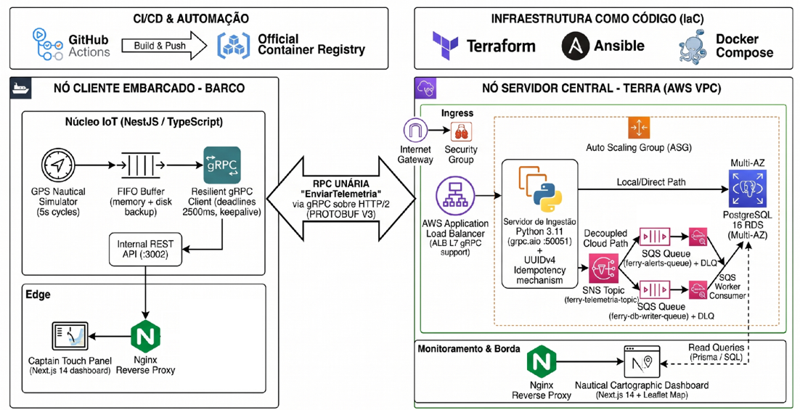

# TDE I - Sistema Distribuído de Telemetria Marítima: Ferry-Boat Salvador - Itaparica

**Disciplina:** Sistemas Distribuídos  
**Equipe:**
- Álex Lima
- Otavio Costa
- Rafael Figueiredo
- Wesley Rios

---

## 1. Ideia do Projeto

O **Sistema Distribuído de Telemetria Marítima do Ferry-Boat Salvador - Itaparica** é concebido para resolver um desafio crítico do mundo real: o monitoramento contínuo, confiável e em tempo real de embarcações marítimas durante a travessia na Baía de Todos-os-Santos (entre o Terminal de São Joaquim e o Terminal de Bom Despacho), operando em um cenário caracterizado por instabilidades severas e quedas frequentes de enlace de rede.

Em alto-mar, a perda transitória de conectividade com a infraestrutura em terra é uma premissa operacional inevitável. Em vez de descartar leituras ou bloquear os sistemas de bordo diante de falhas de comunicação, o projeto propõe a aplicação prática de conceitos fundamentais de Sistemas Distribuídos voltados à **alta disponibilidade e tolerância a particionamentos de rede** (com viés **AP** fundamentado no **Teorema CAP**).

A arquitetura proposta contempla um nó embarcado (a embarcação) equipado com um **buffer FIFO em memória** associado a um mecanismo de **persistência local em disco**. Sob condições de desconexão com a base central, o nó continuará acumulando as métricas náuticas localmente de forma segura. Assim que o canal de rádio ou conexão de rede for restabelecido, o sistema executará o descarregamento automático (*flush*) de todas as mensagens acumuladas, assegurando integridade e ausência de perda de dados.

Para otimizar a transmissão em links marítimos restritos e de baixa largura de banda, a comunicação entre a embarcação e a estação em terra será implementada através de **gRPC sobre HTTP/2**, utilizando **Protocol Buffers v3** como linguagem de definição de interface (IDL) e formato de serialização binária. Esta abordagem viabiliza multiplexação de chamadas em uma única conexão TCP persistente, compactação de cabeçalhos via HPACK e redução substancial da carga útil em relação a padrões REST/JSON.

O projeto visa também demonstrar **transparência de acesso poliglota**, integrando um nó cliente embarcado desenvolvido em **TypeScript (NestJS)** com um nó servidor de ingestão construído em **Python (assíncrono com grpc.aio)**. Para mitigar os impactos de retransmissões do buffer após períodos de partição, cada pacote de telemetria conterá um identificador universal único (**UUIDv4**), viabilizando garantias estritas de **idempotência** na camada de persistência em PostgreSQL.

Como módulos de apoio e validação operacional, serão concebidas duas interfaces em **Next.js 14**: o Painel do Capitão a bordo e o Dashboard Náutico da Central em terra. Toda a solução será projetada para execução conteinerizada via **Docker Compose** em ambiente de desenvolvimento e arquitetura elástica em nuvem **AWS**. Para viabilizar a absorção de picos de carga e assegurar alta disponibilidade da Central, a infraestrutura implementará escalonamento horizontal automatizado das instâncias de ingestão (`ferry-central`): o provisionamento da malha elástica (VPC, instâncias EC2, Auto Scaling Groups, Load Balancers gRPC L7 e RDS Multi-AZ) será orquestrado via **Terraform**, enquanto a padronização, configuração de ambiente e deploy dinâmico das novas réplicas de ingestão serão gerenciados via **Ansible**.

---

### 1.1. Divisão de Papéis e Responsabilidades

Para garantir a modularidade e paralelismo no desenvolvimento do sistema distribuído, as responsabilidades foram alocadas conforme as especialidades técnicas:

- **Álex Lima (Engenharia de Software Embarcado):** Modelagem do nó cliente (NestJS), geração dos stubs gRPC em TypeScript, implementação do simulador GPS, controle de deadlines/keepalive e mecanismo de retenção local (Buffer FIFO em memória + dump em disco).
- **Otavio Costa (Engenharia de Ingestão e Dados):** Concepção do nó central em Python (grpc.aio), implementação do servicer RPC unário, pipeline de validação de schemas Protobuf v3, controle de idempotência transacional via UUIDv4 e mapeamento objeto-relacional (Prisma/PostgreSQL).
- **Rafael Figueiredo (Infraestrutura em Nuvem e IaC):** Desenho da arquitetura AWS, escrita dos manifestos declarativos em Terraform (VPC, Subnets Públicas/Privadas, Security Groups encadeados, ALB L7 com suporte a gRPC, Auto Scaling Group e RDS Multi-AZ).
- **Wesley Rios (Gerência de Configuração, DevOps e Interfaces):** Automação de deploy e configuração de instâncias via Ansible, orquestração local via Docker Compose, configuração dos proxies reversos Nginx e desenvolvimento dos painéis de supervisão em Next.js 14 (Painel do Capitão e Dashboard Náutico com Leaflet).

---

## 2. Escopo do Projeto

### 2.1. Objetivo Geral

Projetar, implementar e validar uma malha de comunicação distribuída de alta performance, fortemente tipada, resiliente e horizontalmente escalável utilizando gRPC sobre HTTP/2, conectando nós de naturezas e linguagens distintas (TypeScript/Node.js e Python) para a transmissão contínua de telemetria de missão crítica, com capacidade de expansão elástica do nó receptor em terra via Infraestrutura como Código (IaC) e Gerência de Configuração.

### 2.2. Escopo Principal

O núcleo do projeto concentra-se estritamente na malha de comunicação distribuída, na formalização de contratos de interface e no tratamento rigoroso das garantias de chamadas remotas de procedimentos (RPC):

1. **Contrato e Definição de Interface (IDL):**
   - Definição formal e canônica de mensagens e serviços através de Protocol Buffers v3.
   - Especificação de RPC unária (o cliente embarcado submete uma única requisição de telemetria e recebe uma confirmação de entrega).
   - Modelagem estrita de tipos: coordenadas geográficas (`latitude`, `longitude` em `double`), contagem de lotação (`passageiros` em `int32`), carimbo de tempo de origem (`timestamp_coleta` em `int64`) e rastreabilidade unívoca (`message_id` em `string` UUIDv4).

2. **Canal de Comunicação e Transporte (gRPC sobre HTTP/2):**
   - **Multiplexação:** Múltiplas requisições e respostas trafegando em um único socket TCP persistente.
   - **Serialização Binária:** Minimização de payload na rede em comparação com abordagens tradicionais baseadas em texto.
   - **Compactação de Cabeçalhos (HPACK):** Redução drástica do overhead em fluxos contínuos de envio periódico (intervalos de 5s).
   - **Manutenção de Sessão:** Configuração de canais assíncronos com políticas de keepalive ativas para detecção proativa de desconexão.

3. **Transparência de Acesso Poliglota:**
   - Cliente gRPC concebido em NestJS, viabilizando invocações remotas com semântica de chamada local.
   - Servidor gRPC implementado em Python utilizando o ecossistema assíncrono nativo `grpc.aio` escutando na porta 50051.
   - Propagação transparente de contexto distribuído por meio de metadados das chamadas RPC.

4. **Resiliência e Tolerância a Falhas na Camada RPC:**
   - **Deadlines Estritos:** Configuração de timeout de 2.500 ms por chamada remota, mitigando contenção de sockets e travamentos no emissor.
   - **Detecção de Quedas:** Captura e tratamento refinado de códigos de erro gRPC (e.g., `UNAVAILABLE`) pelo nó cliente para identificação imediata de interrupção do enlace náutico.
   - **Retenção e Descarregamento Controlado:** Bufferização das telemetrias retidas durante a indisponibilidade do canal e disparo sequencial regulado (*rate limit*) após reconexão.
   - **Idempotência Semântica:** Mecanismo de persistência projetado para absorver retransmissões sem duplicar registros históricos.

5. **Escalonamento Horizontal e Balanceamento gRPC (Camada 7):**
   - **Stateless Servicers:** Concepção do nó de ingestão em Python estritamente sem estado (*stateless*), desacoplando o recebimento do armazenamento (banco/filas) para permitir escalabilidade horizontal linear.
   - **Distribuição de Carga HTTP/2:** Configuração de balanceador L7 (AWS Application Load Balancer ou Nginx `grpc_pass`) para distribuir adequadamente as chamadas RPC entre os nós receptores escalados, contornando o aprisionamento de conexão por multiplexação persistente.

### 2.3. Escopo Secundário

Componentes complementares planejados para contextualizar, simular o fluxo náutico e suportar a validação visual da comunicação distribuída:

- **Simulador Embarcado de Dados Náuticos:** Módulo programático para geração progressiva de coordenadas ao longo da rota marítima Salvador – Bom Despacho a cada 5 segundos.
- **Camada de Persistência e Auditoria:** Banco de dados relacional PostgreSQL para verificação de entrega íntegra, suporte a desduplicação transacional (`ON CONFLICT DO NOTHING`) e cálculo de latência de trânsito em milissegundos.
- **Interfaces Web de Demonstração:**
  - **Painel do Barco (Porta 3000):** Ajuste de taxa de simulação, controle de lotação e acompanhamento em tempo real do estado da fila/buffer local.
  - **Dashboard da Central (Porta 3001):** Renderização cartográfica da embarcação em trânsito com base nos dados processados pelo receptor gRPC.
- **Ambiente de Execução e Nuvem:** Orquestração completa em contêineres via Docker Compose para reprodução local e planos de infraestrutura como código (Terraform/Ansible) para validação em instâncias AWS EC2/RDS.

### 2.4. Critérios de Sucesso e Validação

| Critério | Meta de Validação |
| :--- | :--- |
| **Comunicação Poliglota** | O cliente em Node.js/NestJS deverá invocar com sucesso os procedimentos remotos gRPC expostos pelo servidor em Python, recebendo confirmações de forma consistente. |
| **Adesão ao Contrato Protobuf** | O pipeline deve rejeitar estritamente qualquer mensagem que viole os tipos, campos ou regras estabelecidas no arquivo `.proto` canônico. |
| **Resiliência a Partições** | Ao interromper intencionalmente a conectividade da Central, o nó embarcado deverá reter as coletas sem degradação do processo e descarregá-las integralmente via gRPC assim que o serviço for restabelecido. |
| **Idempotência de Entrega** | O reenvio de uma telemetria com identificador idêntico (`message_id`) deve ser reconhecido pelo servidor com flag de duplicação ativada, sem duplicação de tuplas no banco de dados. |
| **Escalabilidade Horizontal da Central** | Ao disparar o aumento de demanda ou acionar planos de contingência via Terraform/Ansible, novas instâncias do nó central (`ferry-central`) deverão ser provisionadas e configuradas automaticamente, integrando-se ao balanceador gRPC e absorvendo o tráfego sem degradação ou perda de telemetrias. |

---

## 3. Estrutura do Projeto

A organização de diretórios planejada para o ecossistema distribuído mantém a separação canônica dos contratos, nó embarcado, nó servidor central e artefatos de infraestrutura:

```text
ferry-telemetry-tde/
├── proto/                         ---> [NÚCLEO CANÔNICO]
│   └── ferryboat.proto            ---> Contrato IDL Protobuf v3 (RPCs e mensagens)
│
├── ferry-boat/                    ---> [NÓ CLIENTE EMBARCADO (A)]
│   ├── src/
│   │   ├── grpc/                  ---> Stubs TypeScript e cliente gRPC resiliente
│   │   │   ├── ferryboat.ts       ---> Interfaces e tipos gerados via protoc
│   │   │   └── telemetry-grpc.client.ts ---> Invocações RPC, deadlines (2.500ms) e keepalive
│   │   ├── buffer/                ---> Camada de tolerância a quedas do canal gRPC
│   │   │   └── fifo-buffer.service.ts ---> Fila em memória (5.000 itens) + backup em disco
│   │   ├── simulator/             ---> Gerador da carga útil da telemetria (5s)
│   │   └── main.ts                ---> Inicialização do runtime NestJS 10
│   └── frontend/                  ---> [Apoio] Painel tátil do capitão (Next.js 14)
│
├── ferry-central/                 ---> [NÓ SERVIDOR CENTRAL (B)]
│   ├── src/
│   │   ├── server/
│   │   │   ├── main.py            ---> Inicialização do servidor assíncrono grpc.aio (:50051)
│   │   │   ├── service.py         ---> Implementação do FerryTelemetryServicer
│   │   │   └── idempotency.py     ---> Validação de UUIDv4 e controle de duplicação
│   │   ├── proto/                 ---> Stubs gerados em Python (_pb2.py e _pb2_grpc.py)
│   │   └── database/              ---> Camada de persistência (Prisma / PostgreSQL 16)
│   ├── prisma/                    ---> Schema de dados e migrações SQL (coluna STORED)
│   └── frontend/                  ---> [Apoio] Dashboard náutico com Leaflet (Next.js 14)
│
├── docker/                        ---> Configurações de proxies de borda Nginx
├── terraform/                     ---> IaC para provisionamento de VPC, EC2s, RDS e SGs
└── docker-compose.local.yml       ---> Orquestração integrada para execução em 1 comando
```

### Links dos Repositórios:
- **Repositório Principal (Orquestrador):** [https://github.com/RafaelFS01/ferry-telemetry-tde](https://github.com/RafaelFS01/ferry-telemetry-tde)
- **Nó Servidor Central:** [https://github.com/RafaelFS01/ferry-central](https://github.com/RafaelFS01/ferry-central)
- **Nó Cliente Embarcado:** [https://github.com/RafaelFS01/ferry-boat](https://github.com/RafaelFS01/ferry-boat)

### 3.1. Governança do Repositório e Estratégia de Versionamento

A colaboração e a rastreabilidade do código-fonte seguem padrões rigorosos de governança de software distribuído:

- **Estratégia de Branching (GitHub Flow Adaptado):**
  - `main`: Ramo estável, protegido contra push direto, reservado apenas para código homologado e pronto para implantação.
  - `develop`: Ramo de integração contínua para mesclagem de novas funcionalidades antes da homologação.
  - `feature/<nome-da-funcionalidade>`: Branches efêmeras criadas a partir de `develop` para desenvolvimento isolado de componentes (ex.: `feature/grpc-keepalive`, `feature/fifo-disk-buffer`).
  - `fix/<nome-do-bug>`: Correções pontuais de falhas de comunicação ou persistência.
- **Política de Commits:** Adoção estrita da convenção *Conventional Commits* (e.g., `feat:`, `fix:`, `docs:`, `perf:`, `refactor:`, `chore:`) assegurando geração automatizada de changelogs e semântica histórica.
- **Políticas de Integração e Revisão:**
  - Merges na `main` ou `develop` exigem abertura de Pull Request (PR) com aprovação obrigatória de ao menos um revisor (*Code Review*).
  - Execução de pipeline automatizado no GitHub Actions (CI) para linters, validação de compilação dos stubs do Protobuf e execução de testes de compatibilidade binária antes de qualquer aprovação.

---

## 4. Planejamento do Projeto

O cronograma de implementação técnica está estruturado em fases sequenciais de engenharia de software distribuído:

### Fase 1: Concepção do Contrato e Especificação IDL
- **Objetivo:** Definição da interface formal e validação do domínio distribuído.
- **Tarefas a Executar:**
  - Criação do arquivo canônico `ferryboat.proto` com tipagem estrita para telemetria náutica (coordenadas, contagem de passageiros, timestamps em epoch e identificador UUIDv4).
  - Automação de compilação dos stubs via `protoc` / `grpc_tools` para os ecossistemas TypeScript e Python.
  - Implementação de suíte de testes de invariantes para validação de compatibilidade binária entre os compiladores.

### Fase 2: Implementação do Servidor de Ingestão gRPC (Python)
- **Objetivo:** Construção do nó receptor de alto throughput na Central em terra.
- **Tarefas a Executar:**
  - Implementação de servidor assíncrono via `grpc.aio.server()` para suportar alta concorrência nativa.
  - Implementação da RPC unária `EnviarTelemetria`, incluindo validação sintática do payload e extração de metadados da sessão.
  - Construção do mecanismo de desduplicação transacional e idempotência com base na chave `message_id`.
  - Configuração de rotina de *graceful shutdown* (drenagem controlada de conexões) e suporte ao protocolo oficial de gRPC Health Checking.

### Fase 3: Implementação do Cliente gRPC Resiliente (NestJS)
- **Objetivo:** Garantia de transparência de chamada e robustez do nó embarcado contra falhas de enlace.
- **Tarefas a Executar:**
  - Instanciação de canal gRPC configurado com políticas de keepalive ativo (pings periódicos na camada de transporte).
  - Definição de Deadlines rígidos de 2.500 ms para prevenir esgotamento de sockets em situações de degradação da rota.
  - Arquitetura de contingência: interceptor para captura de status `UNAVAILABLE` e redirecionamento de amostras para o buffer FIFO em memória com dump em disco.
  - Mecanismo de descarregamento sequencial pós-reconexão com controle de fluxo (delay de 20ms por mensagem enviada).

### Fase 4: Testes de Resiliência e Cenários de Falha de Rede
- **Objetivo:** Validação empírica dos requisitos de tolerância a falhas na camada gRPC.
- **Cenários Planejados:**
  - **Cenário A (Queda Abrupta do Servidor):** Interrupção forçada da Central com emissão contínua no Barco para validar a integridade do acúmulo no buffer local.
  - **Cenário B (Recuperação do Link):** Restabelecimento do canal da Central para checagem do esvaziamento completo da fila sem perda de registros.
  - **Cenário C (Estresse de Idempotência):** Injeção proposital de chamadas com mesmo `message_id` para validar a resposta `duplicado = true` e ausência de efeitos colaterais na base.
  - **Cenário D (Latência e Overhead):** Medição da latência de trânsito fim a fim no banco de dados e comparação de consumo de banda frente ao padrão REST/JSON.

### Fase 5: Integração dos Módulos de Apoio e Orquestração
- **Objetivo:** Construção das camadas visuais e infraestrutura de suporte à demonstração.
- **Tarefas a Executar:**
  - Desenvolvimento das interfaces em Next.js 14 (Painel de Bordo do Capitão e Dashboard Náutico com Leaflet).
  - Orquestração integrada de contêineres via Docker Compose em malha unificada de rede.
  - Provisionamento da Malha Elástica com Terraform: Módulos para criação de VPC, Subnets, Target Groups com suporte a gRPC, Application Load Balancer (ALB), Auto Scaling Group (ASG) e instâncias EC2 para o `ferry-central`.
  - Automação e Configuração com Ansible: Playbooks para configuração automática dos nós recém-provisionados (instalação de runtime Python/Docker, injeção de variáveis de ambiente, subida do serviço gRPC assíncrono e validação de health-check antes da inclusão no balanceador).
  - Teste de Carga e Escala: Simulação de adição dinâmica de nós centrais durante envio contínuo de telemetria, atestando o balanceamento transparente das requisições.

---

## 5. System Design do Projeto

A arquitetura de System Design do projeto organiza-se em dois macroambientes: o **Nó Cliente Embarcado (Instância A - Barco)** e o **Nó Servidor Central (Instância B - Central de Terra)**, conectados pelo canal de telemetria gRPC sobre HTTP/2.



### 5.1. Nó Cliente Embarcado (Instância A - Barco)

- **Núcleo IoT Embarcado (NestJS):**
  - **Simulador Náutico GPS:** Gera periodicamente (ciclos de 5s) a trajetória Salvador ↔ Itaparica.
  - **Camada de Tolerância a Falhas (CAP / AP):** Buffer FIFO em memória com capacidade para até 5.000 amostras, integrado a backup persistente em disco (`telemetry_buffer_backup.json`) para garantir resiliência contra desligamento acidental da embarcação.
  - **REST API Control & Status (Porta 3002):** Interface interna para fornecimento de métricas locais e estado do nó para a camada visual.
  - **Cliente gRPC Resiliente:** Responsável pela invocação RPC, controle de deadline (2.500 ms), keepalive e propagação de Correlation ID.
- **Apresentação & Borda:**
  - **Borda Reversa Nginx (Porta 80 / 8080):** Rate limiting e hardening de rede.
  - **Painel Tátil do Capitão (Next.js 14 Standalone na Porta 3000):** Controle de lotação, visualização da taxa de envio e estado da fila.

### 5.2. Canal de Comunicação Distribuída

- **RPC Unária `EnviarTelemetria`:** Executada sobre HTTP/2 com Protocol Buffers v3, transportando a carga útil contendo `UUIDv4`, `Latitude`, `Longitude`, `Passageiros` e `Epoch Timestamp`.

### 5.3. Nó Servidor Central (Instância B - Central de Terra)

- **Servidor de Ingestão (Python 3.11):**
  - **Servidor gRPC Assíncrono (grpc.aio na Porta 50051):** Recepção de alto desempenho, validação de schema e verificação de integridade.
  - **Mecanismo de Idempotência:** Controle estrito de duplicidade baseado na chave primária UUIDv4 com política `ON CONFLICT DO NOTHING`.
- **Roteamento e Persistência:**
  - **Modo Direto / Local:** Conexão direta via pool TCP (porta 5432) com o Prisma Client para persistência no PostgreSQL 16.
  - **Modo Nuvem Desacoplado (Mensageria Serverless AWS):** Publicação em tópico SNS (`ferry-telemetria-topic`) com fan-out para filas SQS (`ferry-db-writer-queue` para persistência em lote e `ferry-alerts-queue` para detecção de anomalias/lotação), contando com Dead Letter Queue (DLQ) com retenção de 14 dias e consumidor assíncrono.
  - **Base de Dados Relacional:** PostgreSQL 16 contendo a tabela `telemetrias` com chave primária `message_id` e campo gerado computado `latencia_transito_ms` (`STORED`).
- **Monitoramento Cartográfico:**
  - **Borda Reversa Nginx (Porta 80 / 8081):** Headers de segurança e proxy HTTP.
  - **Dashboard Cartográfico Náutico (Next.js 14 Standalone na Porta 3001):** Visualização espacial da rota em tempo real via Leaflet, OpenStreetMap e gráficos Recharts alimentados por queries Prisma/SQL.
- **Arquitetura de Escalonamento Horizontal (Nó Central):**
  - **Pool de Ingestão Elástico:** Conjunto escalável de instâncias EC2/contêineres executando o serviço `ferry-central` em Python 3.11 (grpc.aio).
  - **Balanceamento L7 gRPC:** Ingress / ALB distribuindo streams HTTP/2 por algoritmo round-robin ou least-outstanding-requests diretamente aos nós de ingestão saudáveis.
  - **Provisionamento Automatizado (Terraform + Ansible):**
    - **Terraform:** Gerencia a infraestrutura declarativa (criação e destruição de instâncias de ingestão sob demanda com base em métricas de CPU/conexões).
    - **Ansible:** Orquestra a inicialização e provisionamento dos nós escalados, garantindo idempotência na configuração do ambiente de runtime e integração imediata ao cluster de ingestão.
  - **Consistência em Múltiplos Nós:** Como múltiplas instâncias da central podem receber pacotes retransmitidos simultaneamente pelo buffer do barco, a idempotência transacional (`ON CONFLICT (message_id) DO NOTHING` no PostgreSQL) garante a integridade dos dados independente de qual nó processe a requisição.

---

## 6. Segurança do Projeto

O planejamento técnico de como cada aspecto de segurança será projetado e implementado na versão final do sistema:

- **Autenticação e Autorização:**
  O escopo do projeto priorizará o contrato de dados e a tolerância a falhas na malha de comunicação distribuída, mantendo as aplicações deliberadamente abertas e sem sobrecarga de validações de sessão. Os painéis web em Next.js 14, a API do simulador em NestJS e o canal de telemetria gRPC não contemplarão telas de login, tokens JWT etc.; o canal operará em modo *insecure* sobre HTTP/2 para reduzir a quantidade de dados trafegados pela rede. Os mecanismos de autenticação serão centralizados estritamente na camada de infraestrutura: o acesso administrativo às instâncias EC2 será restrito por chaves SSH, e as credenciais de acesso ao PostgreSQL serão isoladas.
- **Gestão de Segredos e Tokens:**
  Seguirá as boas práticas de segurança em desenvolvimento de software para prevenir o vazamento de credenciais. Nenhuma senha, chave privada ou arquivo local de ambiente (`.env`) será versionado no repositório Git, sendo blindados no `.gitignore`. Na automação com Terraform, as variáveis sensíveis, como a senha de administração do RDS, serão demarcadas com o atributo `sensitive`, suprimindo sua exibição em logs de terminal e planos de execução. No ambiente de produção e na integração contínua (CI/CD), a injeção de parâmetros sensíveis (chaves SSH, strings de conexão ao banco e tokens do Docker Hub) ocorrerá dinamicamente em tempo de execução via GitHub Actions Secrets.
- **Proteção de Borda:**
  Será projetada através da inclusão de proxies reversos Nginx atuando à frente dos módulos frontend em ambos os nós da arquitetura. O Nginx será configurado para mascarar a assinatura do servidor, aplicar políticas ativas de limitação de taxa (*Rate Limiting* e resposta HTTP 429 para amortecer potenciais ataques de negação de serviço) e injetar cabeçalhos HTTP de proteção estrita, incluindo Content-Security-Policy, prevenção contra Clickjacking e bloqueio de inferência de tipo.
- **Regras de Firewall:**
  Serão estruturadas por meio de AWS Security Groups interdependentes. Apenas o tráfego HTTP padrão (porta 80) e o acesso SSH restrito (porta 22) estarão expostos publicamente à internet. A porta do serviço gRPC na Central será configurada para receber exclusivamente requisições originadas do Security Group ou IP Elástico atribuído ao Barco, mantendo o serviço oculto da internet pública. A porta do PostgreSQL no RDS aceitará conexões provenientes da instância da Central, bloqueando qualquer tentativa de comunicação direta vinda do Barco ou de redes externas.
- **Segmentação de Rede:**
  Toda a infraestrutura em nuvem será isolada em uma Virtual Private Cloud (VPC). As instâncias computacionais (Barco e Central) serão alocadas em subnets públicas com rotas de saída via Internet Gateway para viabilizar os acessos web e rotinas de manutenção SSH. A base de dados relacional (RDS) residirá em subnets privadas sem rotas de saída para a internet, tornando o banco inacessível fora dos limites internos da VPC. No nível do sistema operacional, cada host executará seus contêineres confinados em redes Docker (`barco-net` e `central-net`), garantindo a contenção do tráfego local entre os serviços.

---

## 7. Resolução de Nome, Mapeamento de Domínios e Roteamento de Tráfego

A topologia de resolução de nomes e direcionamento de tráfego fornece desacoplamento total entre os endereços IP efêmeros das instâncias computacionais (AWS EC2) e a lógica de comunicação dos serviços distribuídos. Essa camada garante que a reinicialização de instâncias, expansões por Auto Scaling ou migrações de zona não interfiram na continuidade da telemetria náutica.

### 7.1. Arquitetura de Resolução DNS com AWS Route 53

O ecossistema utiliza o AWS Route 53 dividido em duas Zonas de Hospedagem (*Hosted Zones*) com responsabilidades distintas:

1. **Zona Pública de Borda (Externa):**
   - `telemetry.rioswesley.com.br`: Registro do tipo A (Alias) apontando diretamente para o endpoint canônico do AWS Application Load Balancer (ALB). Este é o alvo estático configurado no cliente gRPC do Nó Barco para o envio de RPCs unárias.
   - `painel.rioswesley.com.br`: Registro do tipo CNAME apontando para a distribuição do painel web de supervisão náutica da Central em terra.
   - `capitao.rioswesley.com.br`: Registro do tipo A resolvido localmente no gateway do porto ou IP dinâmico da embarcação para acesso ao painel de bordo.

2. **Zona Privada da VPC (AWS Route 53 Private Hosted Zone):**
   - **Domínio Interno:** `ferry.internal` (isolado estritamente dentro da VPC).
   - `db.ferry.internal`: Registro do tipo CNAME mapeando o endpoint primário da instância PostgreSQL 16 no Amazon RDS Multi-AZ. As instâncias do pool de ingestão e os workers de mensageria utilizam exclusivamente esse FQDN para inicialização do pool de conexões TCP, mantendo as credenciais desacopladas de endereços IP mutáveis.
   - `events.ferry.internal`: Registro interno via AWS PrivateLink/VPC Endpoints para comunicação direta e privada das instâncias com os tópicos SNS e filas SQS, prevenindo que o tráfego interno trafegue pelo Internet Gateway.

### 7.2. Resolução no Ambiente Local (Docker Compose)

Para paridade em ambiente de desenvolvimento local, a resolução de nomes opera por meio do DNS interno embarcado do Docker (*Docker Embedded DNS* na porta 127.0.0.11), onde os nomes de serviços canônicos (`ferry-central`, `postgres`, `ferry-boat`) são mapeados dinamicamente em redes bridge dedicadas (`barco-net` e `central-net`).

### 7.3. Roteamento Especializado e Distribuição de Carga HTTP/2

O balanceamento de tráfego é tratado na Camada 7 (Aplicação) para mitigar o gargalo clássico de aprisionamento de conexões persistentes em HTTP/2:

- **Roteamento gRPC L7 (AWS ALB):** O balanceador é provisionado com Target Groups configurados explicitamente com o protocolo de versão gRPC. Essa configuração viabiliza que o balanceador abra as conexões HTTP/2 multiplexadas vindas do barco e distribua individualmente cada chamada RPC remota entre as diferentes réplicas ativas no Auto Scaling Group (ASG) utilizando o algoritmo de balanceamento *least outstanding requests*.
- **Proxy de Borda Nginx:** Atua na terminação de tráfego web convencional (HTTP/1.1), aplicando regras de roteamento baseadas em cabeçalhos e paths para servir a aplicação Next.js e proteger as interfaces de monitoramento e supervisão web.
